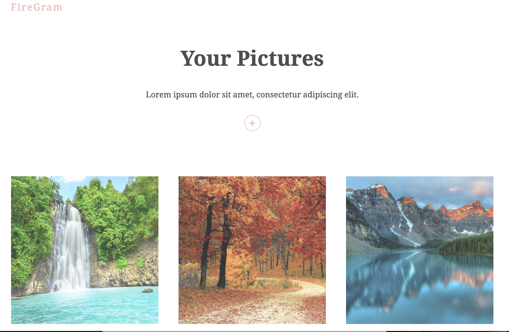

# Firegram

This app allows you to upload photos and renders it for display.



|                               |                                         |                                                   |
| :---------------------------: | :-------------------------------------: | :-----------------------------------------------: |
|   [Introduction](#Firegram)   | [Table of Contents](#table-of-contents) | [Development Highlights](#development-highlights) |
| [Installation](#installation) |    [Page Directory](#page-directory)    |       [Code Hightlights](#code-highlights)        |
| [Technologies](#Technologies) |           [Credits](#Credits)           |                [License](#License)                |

## Development Highlights

- Use input element to upload photos
- Use Firebase Firestore to hold photos in the cloud
- Use framer-motion for smooth animation

## Installation

Install dependencies

```
npm i
```

Start application

```
npm start
```

## Page Directory

The firebase configuration is inside the firebase folder. The hooks for firebase is in it's own folder.

## Code Highlights

Use firestore to organize the images.

```JavaScript
const useFirestore = (collection) => {
    const [docs, setDocs] = useState([])

    useEffect(() => {
        const unsub = projectFirestore.collection(collection)
            .orderBy('createdAt', 'desc')
            .onSnapshot((snap) => {
                let documents = [];
                snap.forEach(doc => {
                    documents.push({ ...doc.data(), id: doc.id })
                })
                setDocs(documents)
            })

        return () => unsub()
    }, [collection])

    return { docs }
}

export default useFirestore
```

## Technologies

- [firebase](https://firebase.google.com/)
- [React](https://reactjs.org/)

## Credits

The tutorial by [Net Ninja](https://www.youtube.com/watch?v=vUe91uOx7R0) was followed.

|                           |                                                                                                                                                                                                       |
| ------------------------- | ----------------------------------------------------------------------------------------------------------------------------------------------------------------------------------------------------- |
| **David Anusontarangkul** | [ LinkedIn](https://www.linkedin.com/in/anusontarangkul/) [ GitHub](https://github.com/anusontarangkul) |

## License

[](https://opensource.org/licenses/)
